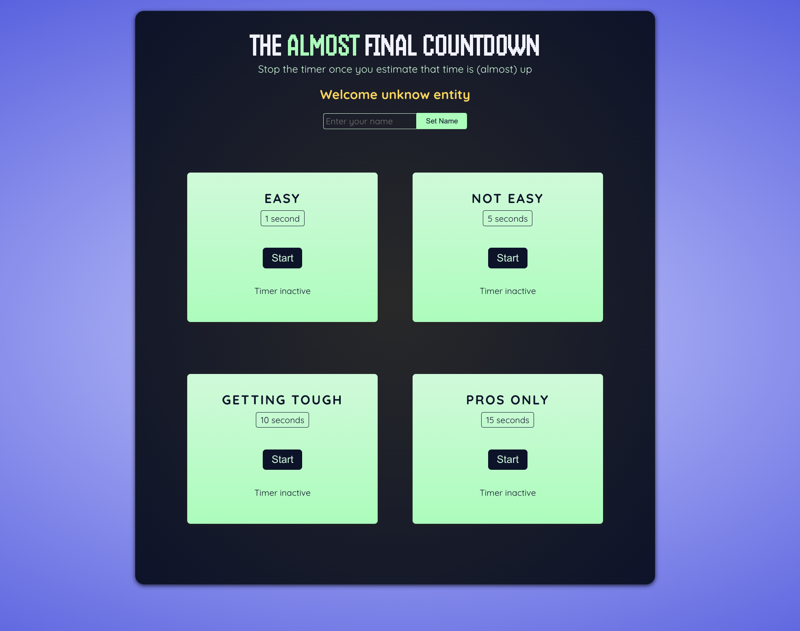

## 🖼️ Game Screen

# TimerChallengeGame

The **TimerChallenge** is a fun and interactive React-based application where users can estimate and stop a timer when they think it's about to finish. The goal is to stop the timer as close to the target time as possible. This app uses React hooks (`useState`, `useRef`, `useImperativeHandle`) and React Portals to manage state and modals.

## Features

- **Start and Stop Timer:** Users can start and stop the timer and attempt to estimate when the target time has passed.
- **Timer Challenges:** Multiple levels with different target times (e.g., Easy, Not Easy, Getting tough, and Pros only).
- **Score Calculation:** The app calculates and shows the user’s score based on the time they stopped the timer.
- **Result Modal:** A modal shows the result when the timer is stopped, indicating whether the user won or lost, and their score.
- **Name Input:** Users can input their name, which is displayed as a welcome message.

## Tech Stack

- **React**: A JavaScript library for building user interfaces.
- **React Portals**: For rendering modals outside the DOM hierarchy.
- **CSS**: For styling the application.

